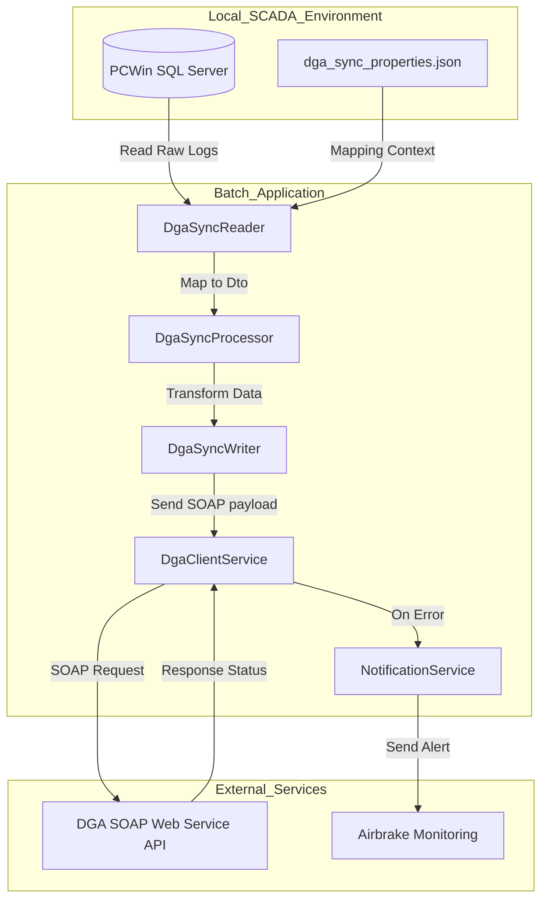

# SIL DGA Synchronizer

`sil-synchronizer` is a Spring Boot & Spring Batch application designed to automate the synchronization of water extraction measurements (flow rates, totalizers, and phreatic/groundwater levels) from a local **PCWin SCADA (SQL Server)** database to the official **DGA (Dirección General de Aguas)** SOAP Web Service API in Chile.

## 🏗️ System Architecture

The application runs as a scheduled batch job, reading records from the local SCADA database, processing them to match the required schemas, sending them via SOAP requests to the DGA platform, and logging the status.



---

## 🛠️ Prerequisites

* **Java Runtime**: JRE or JDK 11 (Amazon Corretto 11 recommended).
* **Database Access**: Read access to the PCWin SCADA SQL Server database (`ScadaNetDb`). If utilizing Windows Integrated Security, the application must run under a Windows user account with appropriate database permissions.
* **Network Connectivity**: HTTPS outbound access to the DGA web service host (`snia.mop.gob.cl`).

---

## ⚙️ Configuration & Environment Variables

The application can be configured via environment variables or by modifying the `src/main/resources/application.properties` file.

### Required Environment Variables
| Variable | Description | Default Value |
| :--- | :--- | :--- |
| `ENVIRONMENT` | Defines application mode. SOAP integration only triggers on `PRODUCTION`. | `LOCAL` |
| `DGA_USER` | RUT of the user registered in the DGA Effective Extractions Portal. | `1-9` |
| `DGA_PASSWORD` | Password for the DGA Effective Extractions Portal. | `*****` |
| `AIRBRAKE_PROJECT_ID` | Project ID for error notifications in Airbrake. | `*****` |
| `AIRBRAKE_PROJECT_KEY` | API Key for error notifications in Airbrake. | `*****` |

### Database & Batch Performance Variables
| Variable | Description | Default Value |
| :--- | :--- | :--- |
| `DB_HOSTNAME` | SQL Server hostname or instance name. | `MYHOTEL-PC\MSSQLSERVER` |
| `DB_PORT` | SQL Server port. | `1433` |
| `DB_DB_NAME` | Database name to query. | `ScadaNetDb;integratedSecurity=true;` |
| `DB_USERNAME` | SQL Server username (if not using Integrated Security). | `*****` |
| `DB_PASSWORD` | SQL Server password (if not using Integrated Security). | `*****` |
| `CHUNK_SIZE` | Size of the transaction block for Spring Batch processing. | `10` |
| `PROPERTIES_FILENAME` | Name of the mapping configuration JSON file. | `dga_sync_properties.json` |

### Synchronization Timing Controls
| Variable | Description | Default Value |
| :--- | :--- | :--- |
| `HOURS_REGRESSION_RETRY` | Number of hours to look back and retry failed submissions. | `24` |
| `HOURS_REGRESSION_TRIGGER`| Hours of missing telemetry before triggering an alert. | `2` |
| `HOURS_OFFSET` | Delay offset (in hours) to wait before sending measurements to ensure data integrity. | `1` |
| `DGA_WEBSERVICE_MAX_ATTEMPTS`| Maximum retries per SOAP call. | `3` |
| `DGA_WEBSERVICE_SECONDS_DELAY`| Time delay (seconds) between successive SOAP calls. | `10` |

---

## 📁 Mapping Configuration (`dga_sync_properties.json`)

To map SCADA physical measuring stations to DGA obra codes, you must place a `dga_sync_properties.json` file in the same directory as the executable `.jar` file.

### Format Example
```json
[
  {
    "numero_estacion": 1,
    "codigo_obra": "OBRA_EXAMPLE_A",
    "numero_informacion_nivel_freatico": 1,
    "numero_informacion_totalizador": 2,
    "numero_informacion_caudal": 3
  },
  {
    "numero_estacion": 2,
    "codigo_obra": "OBRA_EXAMPLE_B",
    "numero_informacion_nivel_freatico": 1,
    "numero_informacion_totalizador": 2,
    "numero_informacion_caudal": 3
  }
]
```
* **`numero_estacion`**: Local station ID in PCWin SCADA.
* **`codigo_obra`**: Registration ID assigned by the DGA.
* **`numero_informacion_nivel_freatico`**: Channel index for the groundwater level.
* **`numero_informacion_totalizador`**: Channel index for the volume totalizer.
* **`numero_informacion_caudal`**: Channel index for the instant flow rate.

---

## 🚀 Execution

### 1. Compilation
Build the executable Jar using the Maven Wrapper:
```shell
# Windows
.\mvnw.cmd clean package -DskipTests

# Linux/macOS
./mvnw clean package -DskipTests
```

### 2. Run the Application
Execute the compiled JAR file:
```shell
java -jar target/Sil_Synchronizer-0.1.0.jar
```

---

## 📄 License
This project is licensed under the [MIT License](https://choosealicense.com/licenses/mit/).